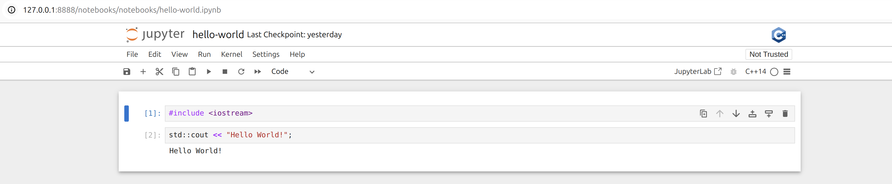

# MTP1 on Notebooks



In this README you will find the instructions
to build the images and create the running container
to interact with the notebooks and the different C++ kernels.

If you want to know more how it works you can read
this interesting [post](https://blog.jupyter.org/interactive-workflows-for-c-with-jupyter-fe9b54227d92).

### Build image

```
docker build -t mtp1 .
```

### Run image

> logs detatached

```
docker run -dp 127.0.0.1:8888:8888 -v $(pwd)/notebooks:/cpp/notebooks --name notebooks-mtp1 mtp1
```

> logs presence

```
docker run -p 127.0.0.1:8888:8888 -v $(pwd)/notebooks:/cpp/notebooks --name notebooks-mtp1 mtp1
```
